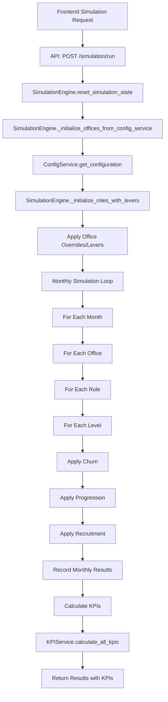
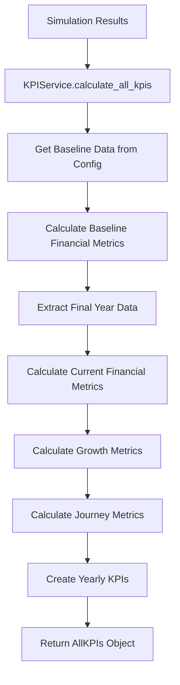

# SimpleSim Architecture Documentation

## Table of Contents
1. [System Overview](#system-overview)
2. [Configuration Management](#configuration-management)
3. [Data Models](#data-models)
4. [Data Flow Architecture](#data-flow-architecture)
5. [Service Layer](#service-layer)
6. [Core Calculations & Formulas](#core-calculations--formulas)
7. [API Structure](#api-structure)
8. [Frontend Architecture](#frontend-architecture)

---

## System Overview

SimpleSim is a workforce simulation and financial modeling platform with a **React + TypeScript frontend** and **FastAPI + Python backend**. The system models organizational growth, financial performance, and workforce dynamics over time.

### Key Components:
- **Configuration Service**: Manages office, role, and level data from Excel imports
- **Simulation Engine**: Processes monthly workforce dynamics (churn, progression, recruitment)
- **KPI Service**: Calculates financial metrics and performance indicators
- **Frontend**: React-based dashboard for configuration, simulation, and visualization

---

## Configuration Management

The configuration system is designed around a single source of truth to ensure data integrity and consistent comparisons.

### 1. Master Configuration File (`office_configuration.json`)
- **Single Source of Truth**: The `backend/config/office_configuration.json` file is the master database for all office configurations. It is the definitive source for all baseline data.
- **Persistence**: This file persists all settings for offices, roles, and financial parameters.

### 2. System Startup Logic
1.  **Check for Configuration**: On application startup, the `ConfigService` checks if `office_configuration.json` exists and contains data.
2.  **Load Existing Config**: If the file has content, it is loaded into memory and used as the active configuration.
3.  **Handle Empty/Missing Config**: If the file is empty or does not exist, the system enters a state where it requires the user to upload a configuration file (typically via an Excel import) to populate the initial settings.

### 3. Excel Import Logic (Partial Update)
- **Purpose**: Excel uploads are used to **update or add** data to the master configuration, not to replace it entirely.
- **Mechanism**: When a user uploads an Excel file with configuration data, the `ConfigService` performs a **partial update**. It iterates through the offices in the uploaded file and updates the corresponding entries in `office_configuration.json`.
- **Behavior**:
    - If an office from the Excel file already exists in the JSON, its values are overwritten.
    - If an office does not exist, it is added.
    - Offices present in the JSON but **not** in the Excel file are left untouched. This is critical for managing configurations for multiple offices when an upload only contains a subset.

### 4. Baseline Definition
- **The "Baseline"**: For all KPI calculations and UI comparisons, the "baseline" is defined as the current state of the data in `office_configuration.json`.
- **Consistency**: This ensures that all simulation runs are compared against a stable and known configuration state, regardless of any temporary levers applied during a simulation run.

---

## Data Models

### Core Data Objects

#### 1. Configuration Data (`config_service.py`)

**Structure**: Dictionary-based, persisted in JSON file (`config/office_configuration.json`)

```python
{
  "office_name": {
    "name": str,
    "total_fte": float,
    "journey": str,  # "New Office", "Emerging Office", "Established Office", "Mature Office"
    "roles": {
      "role_name": {  # "Consultant", "Sales", "Recruitment", "Operations"
        "level_name": {  # "A", "AC", "C", "SrC", "AM", "M", "SrM", "PiP"
          "fte": float,
          "price_1": float, "price_2": float, ..., "price_12": float,
          "salary_1": float, "salary_2": float, ..., "salary_12": float,
          "recruitment_1": float, ..., "recruitment_12": float,
          "churn_1": float, ..., "churn_12": float,
          "progression_1": float, ..., "progression_12": float,
          "utr_1": float, ..., "utr_12": float
        }
      }
    }
  }
}
```

#### 2. Simulation Engine Objects (`simulation_engine.py`)

**Structure**: Python dataclasses with individual tracking

```python
@dataclass
class Person:
    id: str
    career_start: str
    current_level: str
    level_start: str
    role: str
    office: str

@dataclass
class Level:
    name: str
    journey: Journey
    progression_months: List[Month]
    # Monthly attributes (1-12 for each)
    progression_1-12: float
    recruitment_1-12: float
    churn_1-12: float
    price_1-12: float
    salary_1-12: float
    utr_1-12: float
    # Individual tracking
    people: List[Person]
    fractional_recruitment: float
    fractional_churn: float

@dataclass
class RoleData:
    # Same monthly structure as Level
    # Used for flat roles like Operations

@dataclass
class Office:
    name: str
    journey: OfficeJourney
    total_fte: int
    roles: Dict[str, Union[Dict[str, Level], RoleData]]
```

#### 3. Simulation Results

**Structure**: Nested dictionaries with monthly time series

```python
{
  "years": {
    "2025": {
      "months": ["JAN", "FEB", "MAR"],
      "offices": {
        "Stockholm": {
          "levels": {
            "Consultant": {
              "A": [
                {"total": 69, "price": 1200, "salary": 45000, "recruited": 3, "churned": 2, "progressed_out": 0, "progressed_in": 0},
                {"total": 70, "price": 1203, "salary": 45135, "recruited": 4, "churned": 1, "progressed_out": 1, "progressed_in": 2},
                // ... monthly data points
              ]
            }
          },
          "operations": [...],
          "journey_totals": {...},
          "metrics": [...]
        }
      },
      "summary": {
        "total_fte": 1972,
        "total_revenue": 3582197498,
        "total_costs": 4961803997,
        "total_profit": -1379606499,
        "average_margin": -38.51,
        "growth_rate": 0.0
      }
    }
  },
  "kpis": {
    "financial": {...},
    "growth": {...},
    "journeys": {...},
    "yearly_kpis": {...}
  }
}
```

#### 4. KPI Data Objects (`kpi_service.py`)

**Structure**: Dataclasses for structured KPI results

```python
@dataclass
class FinancialKPIs:
    net_sales: float
    net_sales_baseline: float
    ebitda: float
    ebitda_baseline: float
    margin: float
    margin_baseline: float
    total_consultants: int
    total_consultants_baseline: int
    avg_hourly_rate: float
    avg_hourly_rate_baseline: float
    avg_utr: float

@dataclass
class GrowthKPIs:
    total_growth_percent: float
    total_growth_absolute: float
    current_total_fte: float
    baseline_total_fte: float
    non_debit_ratio: float
    non_debit_ratio_baseline: float
    non_debit_delta: float

@dataclass
class AllKPIs:
    financial: FinancialKPIs
    growth: GrowthKPIs
    journeys: JourneyKPIs
    yearly_kpis: Dict[str, YearlyKPIs]
```

---

## Data Flow Architecture

### 1. Configuration Flow

```mermaid
graph TD
    subgraph Startup
        A[Application Starts] --> B{Check office_configuration.json};
        B -- Exists and has content --> C[Load JSON to memory];
        B -- Empty or Missing --> D[Wait for User Upload];
    end

    subgraph User-Triggered Update
        E[Excel File Upload] --> F[/api/offices/config/import];
        F --> G[ConfigService.import_from_excel];
        G --> H[Parse & Validate Data];
        H --> I[Partially Update office_configuration.json];
        I --> J[Update In-Memory Cache];
        J --> K[Return Status to Frontend];
    end

    subgraph Data Retrieval
        L[Frontend Page Load] --> M[API: GET /offices/config];
        M --> N[ConfigService.get_configuration];
        N --> O[Read from In-Memory Cache/JSON];
        O --> P[Return Configuration Array];
    end
```

### 2. Simulation Flow



### 3. KPI Calculation Flow



---

## Service Layer

### 1. ConfigService (`config_service.py`)

**Purpose**: Manages the lifecycle of configuration data, treating `office_configuration.json` as the single source of truth.

**Key Methods**:
- `import_from_excel(df)`: Parses an Excel file and performs a **partial update** of the master `office_configuration.json` file. It updates existing office data and adds new ones without removing others.
- `get_configuration()`: Get current config from the in-memory cache, which is loaded from the JSON file.
- `set_value(office, role, level, attribute, value)`: Update a specific value in the configuration.
- `update_configuration(config)`: **DEPRECATED/DANGEROUS**. This method replaces the entire configuration and should be used with caution as it bypasses the partial update logic.

**Data Storage**: A master JSON file (`office_configuration.json`) with an in-memory cache for performance. The cache is invalidated and reloaded when the JSON file is modified.

### 2. SimulationEngine (`simulation_engine.py`)

**Purpose**: Core simulation logic and workforce dynamics

**Key Methods**:
- `run_simulation(start_year, start_month, end_year, end_month, ...)`: Main simulation loop
- `reset_simulation_state()`: Clear state for fresh simulation
- `_initialize_offices_from_config_service()`: Load config into simulation objects
- `_initialize_roles_with_levers()`: Apply levers/overrides to configuration

**Processing Order (Monthly)**:
1. **Churn**: Remove people based on churn rates
2. **Progression**: Move people between levels (only in evaluation months)
3. **Recruitment**: Add new hires based on recruitment rates

### 3. KPIService (`kpi_service.py`)

**Purpose**: Financial calculations and performance metrics

**Key Methods**:
- `calculate_all_kpis(simulation_results, duration_months, ...)`: Main KPI calculation
- `_calculate_baseline_financial_metrics()`: Calculate baseline from config
- `_calculate_current_financial_metrics()`: Calculate metrics from simulation results
- `_calculate_growth_metrics()`: Compare baseline vs current

### 4. CacheService (`cache_service.py`)

**Purpose**: Caching simulation results for performance

**Key Methods**:
- `get_cached_result(cache_key)`: Retrieve cached simulation
- `cache_result(cache_key, result)`: Store simulation result
- `clear_cache()`: Clear all cached results

---

## Core Calculations & Formulas

### 1. Monthly Workforce Dynamics

#### Churn (Applied First)
```python
# Deterministic fractional accumulation
exact_churn = current_total * churn_rate
level.fractional_churn += exact_churn
churn_count = int(level.fractional_churn)
level.fractional_churn -= churn_count
new_total = current_total - churn_count
```

#### Progression (Applied Second, Only in Evaluation Months)
```python
# A-AM levels: May (month 5) and November (month 11)
# M+ levels: November (month 11) only
# Operations: No progression

if current_month in level.progression_months:
    progression_rate = level.progression_X  # X = current month
    progressed_count = current_total * progression_rate
    # Move people to next level
else:
    progression_rate = 0.0
```

#### Recruitment (Applied Third)
```python
# Deterministic fractional accumulation
exact_recruits = current_total * recruitment_rate
level.fractional_recruitment += exact_recruits
new_recruits = int(level.fractional_recruitment)
level.fractional_recruitment -= new_recruits

# Special case for zero FTE
if current_total == 0 and recruitment_rate > 0:
    new_recruits = max(1, int(recruitment_rate * 10))
```

### 2. Financial Calculations

#### Revenue Calculation
```python
# Per consultant per month
working_hours_per_month = 166.4
unplanned_absence_rate = 0.157  # 5% default
utr = 0.85  # Utilization rate (85% default)

available_hours = working_hours_per_month * (1 - unplanned_absence_rate)
billable_hours = available_hours * utr
monthly_revenue_per_person = hourly_rate * billable_hours
total_revenue = sum(consultant_count * monthly_revenue_per_person * duration_months)
```

#### Cost Calculation
```python
# Employment costs (salary + social costs)
total_employment_cost_rate = 0.50  # 50% additional costs
base_salary_cost = fte_count * monthly_salary * duration_months
total_employment_cost = base_salary_cost * (1 + total_employment_cost_rate)

# Add other expenses (global monthly cost for entire organization)
other_expense = 19000000.0  # 19M SEK per month globally (default)
group_other_expenses = other_expense * duration_months
total_costs = total_employment_cost + group_other_expenses
```

#### EBITDA & Margin
```python
ebitda = total_revenue - total_costs
margin = (ebitda / total_revenue) * 100 if total_revenue > 0 else 0.0
```

### 3. Office Journey Classification

```python
# Based on total FTE
if total_fte >= 500:
    journey = "Mature Office"
elif total_fte >= 200:
    journey = "Established Office"
elif total_fte >= 25:
    journey = "Emerging Office"
else:
    journey = "New Office"
```

### 4. Growth Metrics

```python
# Total growth rate
total_growth_rate = ((current_total_fte - baseline_total_fte) / baseline_total_fte * 100) if baseline_total_fte > 0 else 0.0

# Non-debit ratio (senior consultants percentage)
senior_levels = ['M', 'SrM', 'PiP']
senior_consultants = sum(level_fte for level_name, level_fte in consultant_levels.items() if level_name in senior_levels)
non_debit_ratio = (senior_consultants / total_consultants * 100) if total_consultants > 0 else 0.0
```

---

## API Structure

### Configuration Endpoints
- `GET /offices/config`: Get configuration array for frontend
- `POST /offices/config/import`: Import Excel configuration
- `POST /offices/config/update`: Update configuration
- `GET /offices/`: Get office list with computed totals

### Simulation Endpoints
- `POST /simulation/run`: Run simulation with parameters
- `GET /simulation/config/validation`: Validate current configuration

### Health Endpoints
- `GET /health`: System health check with configuration status

---

## Frontend Architecture

### State Management
- **Local State**: React `useState` for component-specific data
- **Configuration Context**: React Context for shared configuration data
- **Year Navigation**: Custom hook for multi-year data navigation

### Key Components
- **Configuration Page**: Excel import and data management
- **SimulationLabV2**: Main simulation interface with levers
- **Dashboard**: Results visualization and KPI display
- **Charts**: Responsive data visualization components

### Data Flow
1. Configuration loaded from backend via API
2. Simulation parameters set via UI controls
3. Simulation run via API call
4. Results processed and displayed in tables/charts
5. Year-over-year navigation for historical data

---

## Key Design Patterns

### 1. Configuration Persistence
- **JSON File Storage**: Simple, file-based persistence for configuration
- **In-Memory Caching**: Fast access with modification time checking
- **Atomic Updates**: Complete configuration replacement for consistency

### 2. Simulation State Management
- **Fresh State**: Engine reset before each simulation run
- **Deterministic Results**: Fractional accumulation for reproducible outcomes
- **Individual Tracking**: Person-level tracking for detailed analytics

### 3. Financial Calculations
- **Annualized Baselines**: Baseline metrics multiplied by 12 for annual comparison
- **Monthly Granularity**: All rates and calculations operate on monthly basis
- **Consistent Formulas**: Same calculation logic for baseline and simulation data

### 4. Error Handling
- **Graceful Degradation**: System continues with warnings for missing data
- **Comprehensive Logging**: Detailed debug output for troubleshooting
- **Validation**: Input validation at API and service layers 