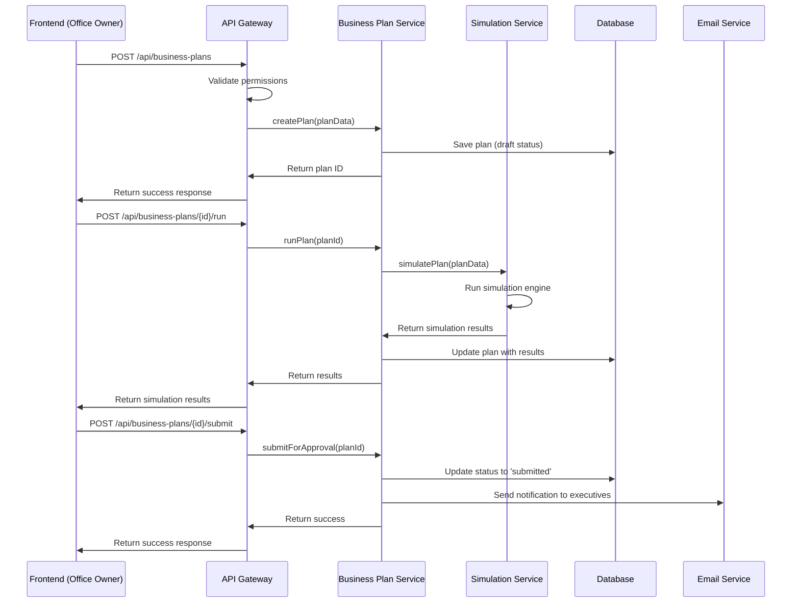
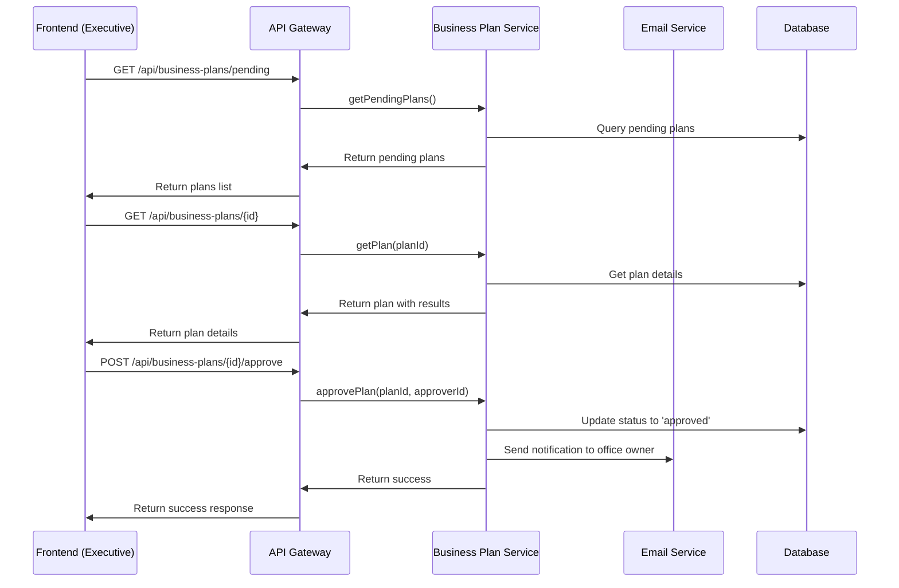
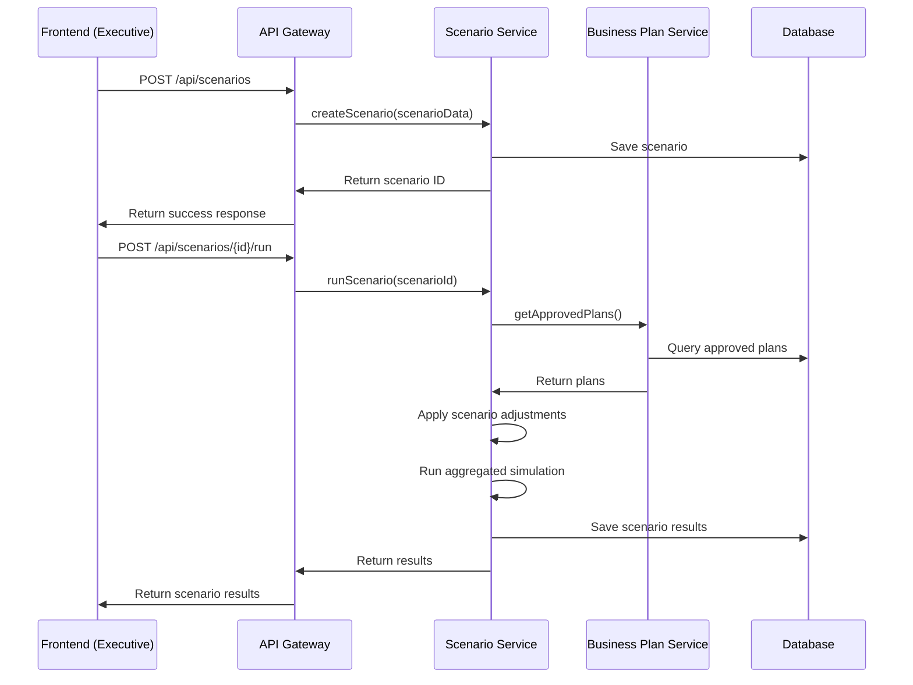
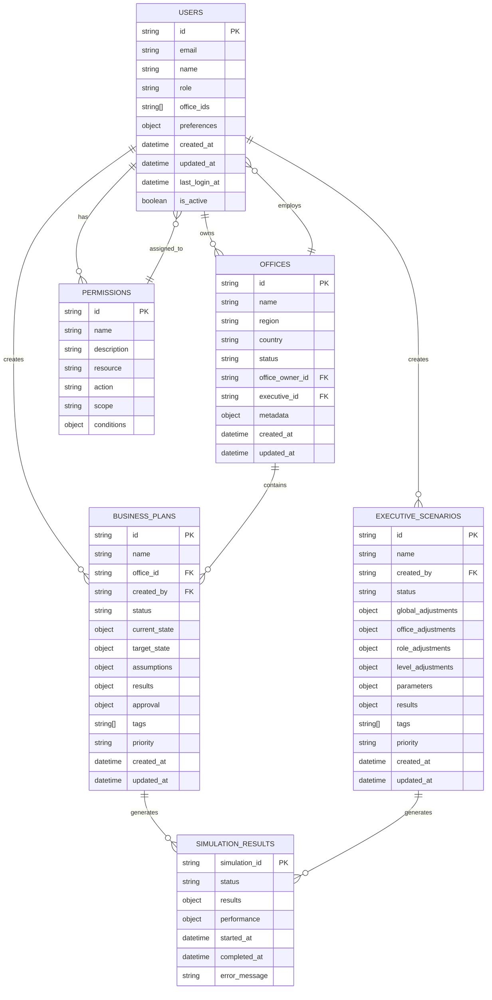

# Data Flow and Data Models

## Overview

This document provides detailed technical specifications for the data flow and data models in the redesigned scenario system. It covers how data moves through the system, the structure of data models, and the relationships between different components.

## Table of Contents

1. [Data Flow Architecture](#data-flow-architecture)
2. [Core Data Models](#core-data-models)
3. [Data Relationships](#data-relationships)
4. [API Data Flow](#api-data-flow)
5. [Database Schema](#database-schema)
6. [Data Validation](#data-validation)
7. [Performance Considerations](#performance-considerations)

## Data Flow Architecture

### High-Level Data Flow

```
┌─────────────────┐    ┌─────────────────┐    ┌─────────────────┐
│   Frontend      │    │   API Gateway   │    │   Backend       │
│   (React)       │◄──►│   (FastAPI)     │◄──►│   Services      │
└─────────────────┘    └─────────────────┘    └─────────────────┘
         │                       │                       │
         │                       │                       │
         ▼                       ▼                       ▼
┌─────────────────┐    ┌─────────────────┐    ┌─────────────────┐
│   State         │    │   Authentication│    │   Business      │
│   Management    │    │   & Permissions │    │   Logic         │
│   (Zustand)     │    │                 │    │   Layer         │
└─────────────────┘    └─────────────────┘    └─────────────────┘
                                                       │
                                                       ▼
                                              ┌─────────────────┐
                                              │   Data Layer    │
                                              │   (PostgreSQL)  │
                                              └─────────────────┘
```

### Detailed Data Flow by User Action

#### 1. Office Owner Creates Business Plan



#### 2. Executive Reviews and Approves Plan



#### 3. Executive Creates Strategic Scenario



## Core Data Models

### 1. Business Plan Model

```typescript
interface BusinessPlan {
  // Core identifiers
  id: string;
  name: string;
  description?: string;
  office_id: string;
  created_by: string;
  created_at: Date;
  updated_at: Date;
  
  // Status and workflow
  status: 'draft' | 'submitted' | 'approved' | 'rejected' | 'in_progress' | 'completed';
  version: number;
  
  // Current state (baseline data)
  current_state: {
    total_fte: number;
    total_revenue: number;
    total_cost: number;
    margin_percentage: number;
    roles: {
      [role: string]: {
        [level: string]: {
          fte: number;
          monthly_recruitment: number;
          monthly_churn_rate: number;
          progression_rate: number;
          revenue_per_fte: number;
          cost_per_fte: number;
          utilization_rate: number;
        }
      }
    }
  };
  
  // Target state (what we want to achieve)
  target_state: {
    target_fte: number;
    target_revenue: number;
    target_margin: number;
    target_growth_rate: number;
    roles: {
      [role: string]: {
        [level: string]: {
          target_fte: number;
          target_recruitment: number;
          target_churn_rate: number;
          target_progression_rate: number;
        }
      }
    }
  };
  
  // Assumptions and constraints
  assumptions: {
    revenue_per_fte: number;
    cost_per_fte: number;
    utilization_rate: number;
    max_recruitment_capacity: number;
    budget_constraint: number;
    time_horizon_months: number;
    growth_assumptions: {
      market_growth_rate: number;
      competitive_factors: number;
      economic_conditions: number;
    }
  };
  
  // Simulation results
  results?: {
    achieved_fte: number;
    achieved_revenue: number;
    achieved_margin: number;
    achieved_growth_rate: number;
    monthly_breakdown: Array<{
      month: string;
      fte: number;
      revenue: number;
      cost: number;
      margin: number;
      recruitment: number;
      churn: number;
      progression: number;
    }>;
    kpis: {
      roi: number;
      payback_period: number;
      risk_level: 'low' | 'medium' | 'high';
      confidence_interval: {
        min: number;
        max: number;
      };
    };
    alerts: Array<{
      type: 'warning' | 'error' | 'info';
      message: string;
      severity: 'low' | 'medium' | 'high';
    }>;
  };
  
  // Approval workflow
  approval?: {
    submitted_at: Date;
    submitted_by: string;
    reviewed_by?: string;
    reviewed_at?: Date;
    status: 'pending' | 'approved' | 'rejected' | 'changes_requested';
    comments?: string;
    requested_changes?: string[];
    approval_notes?: string;
  };
  
  // Metadata
  tags: string[];
  priority: 'low' | 'medium' | 'high';
  estimated_impact: {
    revenue_impact: number;
    cost_impact: number;
    fte_impact: number;
  };
}
```

### 2. Executive Scenario Model

```typescript
interface ExecutiveScenario {
  // Core identifiers
  id: string;
  name: string;
  description?: string;
  created_by: string;
  created_at: Date;
  updated_at: Date;
  
  // Status
  status: 'draft' | 'active' | 'archived' | 'approved';
  
  // Global adjustments (apply to all offices)
  global_adjustments: {
    recruitment_multiplier: number;
    churn_multiplier: number;
    progression_multiplier: number;
    revenue_multiplier: number;
    cost_multiplier: number;
    utilization_multiplier: number;
    market_conditions: {
      market_growth_rate: number;
      competitive_intensity: number;
      economic_outlook: number;
    };
  };
  
  // Office-specific adjustments (override global)
  office_adjustments: {
    [office_id: string]: {
      recruitment_multiplier?: number;
      churn_multiplier?: number;
      progression_multiplier?: number;
      revenue_multiplier?: number;
      cost_multiplier?: number;
      utilization_multiplier?: number;
      market_conditions?: {
        market_growth_rate?: number;
        competitive_intensity?: number;
        economic_outlook?: number;
      };
    }
  };
  
  // Role-specific adjustments (override office)
  role_adjustments: {
    [role: string]: {
      recruitment_multiplier?: number;
      churn_multiplier?: number;
      progression_multiplier?: number;
      revenue_multiplier?: number;
      cost_multiplier?: number;
    }
  };
  
  // Level-specific adjustments (most specific)
  level_adjustments: {
    [role: string]: {
      [level: string]: {
        recruitment_multiplier?: number;
        churn_multiplier?: number;
        progression_multiplier?: number;
        revenue_multiplier?: number;
        cost_multiplier?: number;
      }
    }
  };
  
  // Scenario parameters
  parameters: {
    time_horizon_months: number;
    simulation_frequency: 'monthly' | 'quarterly' | 'yearly';
    include_uncertainty: boolean;
    confidence_level: number;
    max_iterations: number;
  };
  
  // Results
  results?: {
    total_fte: number;
    total_revenue: number;
    total_cost: number;
    total_margin: number;
    growth_rate: number;
    roi: number;
    
    office_results: {
      [office_id: string]: {
        fte: number;
        revenue: number;
        cost: number;
        margin: number;
        growth_rate: number;
        kpis: {
          roi: number;
          payback_period: number;
          risk_level: 'low' | 'medium' | 'high';
        };
      }
    };
    
    monthly_breakdown: Array<{
      month: string;
      total_fte: number;
      total_revenue: number;
      total_cost: number;
      total_margin: number;
      growth_rate: number;
    }>;
    
    role_breakdown: {
      [role: string]: {
        total_fte: number;
        total_revenue: number;
        total_cost: number;
        growth_rate: number;
      }
    };
    
    alerts: Array<{
      office_id?: string;
      type: 'warning' | 'error' | 'info';
      message: string;
      severity: 'low' | 'medium' | 'high';
    }>;
  };
  
  // Metadata
  tags: string[];
  priority: 'low' | 'medium' | 'high';
  estimated_impact: {
    revenue_impact: number;
    cost_impact: number;
    fte_impact: number;
  };
}
```

### 3. User and Permission Models

```typescript
interface User {
  id: string;
  email: string;
  name: string;
  role: 'office_owner' | 'executive' | 'admin' | 'viewer';
  office_ids: string[];
  permissions: Permission[];
  preferences: {
    default_office_id?: string;
    dashboard_layout: string;
    notification_settings: {
      email_notifications: boolean;
      plan_approvals: boolean;
      scenario_results: boolean;
    };
  };
  created_at: Date;
  updated_at: Date;
  last_login_at?: Date;
  is_active: boolean;
}

interface Permission {
  id: string;
  name: string;
  description: string;
  resource: 'business_plan' | 'scenario' | 'office' | 'user' | 'system';
  action: 'create' | 'read' | 'update' | 'delete' | 'approve' | 'run';
  scope: 'own' | 'office' | 'region' | 'all';
  conditions?: {
    office_ids?: string[];
    role_restrictions?: string[];
    time_restrictions?: {
      start_time?: string;
      end_time?: string;
    };
  };
}

interface Office {
  id: string;
  name: string;
  region: string;
  country: string;
  status: 'active' | 'inactive' | 'planned';
  office_owner_id: string;
  executive_id: string;
  created_at: Date;
  updated_at: Date;
  
  // Office metadata
  metadata: {
    timezone: string;
    currency: string;
    language: string;
    office_type: 'mature' | 'growth' | 'new';
    employee_count: number;
    annual_revenue: number;
  };
}
```

### 4. Simulation Engine Models

```typescript
interface SimulationConfig {
  // Core configuration
  simulation_id: string;
  name: string;
  type: 'business_plan' | 'scenario' | 'comparison';
  
  // Input data
  baseline_data: {
    offices: {
      [office_id: string]: OfficeBaselineData;
    };
  };
  
  // Adjustments to apply
  adjustments: {
    global: GlobalAdjustments;
    office_specific: {
      [office_id: string]: OfficeAdjustments;
    };
    role_specific: {
      [role: string]: RoleAdjustments;
    };
  };
  
  // Simulation parameters
  parameters: {
    time_horizon_months: number;
    simulation_frequency: 'monthly' | 'quarterly' | 'yearly';
    include_uncertainty: boolean;
    confidence_level: number;
    max_iterations: number;
    random_seed?: number;
  };
}

interface SimulationResult {
  simulation_id: string;
  status: 'running' | 'completed' | 'failed' | 'cancelled';
  started_at: Date;
  completed_at?: Date;
  error_message?: string;
  
  // Results data
  results: {
    summary: {
      total_fte: number;
      total_revenue: number;
      total_cost: number;
      total_margin: number;
      growth_rate: number;
      roi: number;
    };
    
    monthly_data: Array<{
      month: string;
      total_fte: number;
      total_revenue: number;
      total_cost: number;
      total_margin: number;
      growth_rate: number;
      
      office_breakdown: {
        [office_id: string]: {
          fte: number;
          revenue: number;
          cost: number;
          margin: number;
        };
      };
      
      role_breakdown: {
        [role: string]: {
          fte: number;
          revenue: number;
          cost: number;
        };
      };
    }>;
    
    kpis: {
      roi: number;
      payback_period: number;
      risk_level: 'low' | 'medium' | 'high';
      confidence_interval: {
        min: number;
        max: number;
      };
    };
    
    alerts: Array<{
      type: 'warning' | 'error' | 'info';
      message: string;
      severity: 'low' | 'medium' | 'high';
      office_id?: string;
      role?: string;
      level?: string;
    }>;
  };
  
  // Performance metrics
  performance: {
    execution_time_ms: number;
    memory_usage_mb: number;
    iterations_completed: number;
  };
}
```

## Data Relationships

### Entity Relationship Diagram



### Data Dependencies

#### Business Plan Dependencies
```
Business Plan
├── Office (required)
├── User (creator)
├── Current State Data (from office config)
├── Target State (user input)
├── Assumptions (user input + defaults)
└── Results (from simulation)
```

#### Executive Scenario Dependencies
```
Executive Scenario
├── User (creator)
├── Global Adjustments (user input)
├── Office Adjustments (user input)
├── Role Adjustments (user input)
├── Business Plans (approved plans)
└── Results (from aggregated simulation)
```

#### Simulation Dependencies
```
Simulation
├── Baseline Data (from office configs)
├── Adjustments (from plan or scenario)
├── Parameters (user input + defaults)
└── Results (computed)
```

## API Data Flow

### Request/Response Patterns

#### 1. Business Plan Creation Flow

**Request:**
```typescript
POST /api/business-plans
{
  "name": "Q1 2025 Growth Plan",
  "office_id": "stockholm-01",
  "current_state": {
    "roles": {
      "Consultant": {
        "A": {
          "fte": 50,
          "monthly_recruitment": 5,
          "monthly_churn_rate": 0.02
        }
      }
    }
  },
  "target_state": {
    "roles": {
      "Consultant": {
        "A": {
          "target_fte": 60,
          "target_recruitment": 6
        }
      }
    }
  },
  "assumptions": {
    "revenue_per_fte": 5000,
    "cost_per_fte": 3500
  }
}
```

**Response:**
```typescript
{
  "success": true,
  "data": {
    "id": "plan-123",
    "name": "Q1 2025 Growth Plan",
    "status": "draft",
    "created_at": "2025-01-15T10:30:00Z",
    "validation": {
      "is_valid": true,
      "warnings": [],
      "errors": []
    }
  }
}
```

#### 2. Plan Simulation Flow

**Request:**
```typescript
POST /api/business-plans/plan-123/run
{
  "parameters": {
    "time_horizon_months": 12,
    "include_uncertainty": true,
    "confidence_level": 0.95
  }
}
```

**Response:**
```typescript
{
  "success": true,
  "data": {
    "simulation_id": "sim-456",
    "status": "completed",
    "results": {
      "achieved_fte": 58,
      "achieved_revenue": 290000,
      "achieved_margin": 0.15,
      "monthly_breakdown": [...],
      "kpis": {
        "roi": 0.25,
        "risk_level": "medium"
      }
    }
  }
}
```

#### 3. Executive Scenario Flow

**Request:**
```typescript
POST /api/scenarios
{
  "name": "Aggressive Growth Q1 2025",
  "global_adjustments": {
    "recruitment_multiplier": 1.15,
    "churn_multiplier": 0.90
  },
  "office_adjustments": {
    "stockholm-01": {
      "recruitment_multiplier": 1.20
    }
  },
  "parameters": {
    "time_horizon_months": 12
  }
}
```

**Response:**
```typescript
{
  "success": true,
  "data": {
    "id": "scenario-789",
    "name": "Aggressive Growth Q1 2025",
    "status": "draft",
    "created_at": "2025-01-15T11:00:00Z"
  }
}
```

### Error Handling

#### Standard Error Response
```typescript
{
  "success": false,
  "error": {
    "code": "VALIDATION_ERROR",
    "message": "Invalid business plan data",
    "details": {
      "field": "target_state.roles.Consultant.A.target_fte",
      "issue": "Target FTE cannot be negative"
    }
  }
}
```

#### Common Error Codes
- `VALIDATION_ERROR`: Data validation failed
- `PERMISSION_DENIED`: User lacks required permissions
- `RESOURCE_NOT_FOUND`: Requested resource doesn't exist
- `SIMULATION_ERROR`: Simulation engine error
- `CONSTRAINT_VIOLATION`: Business rule violation

## Database Schema

### PostgreSQL Tables

#### users
```sql
CREATE TABLE users (
    id UUID PRIMARY KEY DEFAULT gen_random_uuid(),
    email VARCHAR(255) UNIQUE NOT NULL,
    name VARCHAR(255) NOT NULL,
    role VARCHAR(50) NOT NULL CHECK (role IN ('office_owner', 'executive', 'admin', 'viewer')),
    office_ids UUID[] DEFAULT '{}',
    permissions JSONB DEFAULT '[]',
    preferences JSONB DEFAULT '{}',
    created_at TIMESTAMP WITH TIME ZONE DEFAULT NOW(),
    updated_at TIMESTAMP WITH TIME ZONE DEFAULT NOW(),
    last_login_at TIMESTAMP WITH TIME ZONE,
    is_active BOOLEAN DEFAULT true
);
```

#### offices
```sql
CREATE TABLE offices (
    id UUID PRIMARY KEY DEFAULT gen_random_uuid(),
    name VARCHAR(255) NOT NULL,
    region VARCHAR(100) NOT NULL,
    country VARCHAR(100) NOT NULL,
    status VARCHAR(50) NOT NULL DEFAULT 'active' CHECK (status IN ('active', 'inactive', 'planned')),
    office_owner_id UUID REFERENCES users(id),
    executive_id UUID REFERENCES users(id),
    metadata JSONB DEFAULT '{}',
    created_at TIMESTAMP WITH TIME ZONE DEFAULT NOW(),
    updated_at TIMESTAMP WITH TIME ZONE DEFAULT NOW()
);
```

#### business_plans
```sql
CREATE TABLE business_plans (
    id UUID PRIMARY KEY DEFAULT gen_random_uuid(),
    name VARCHAR(255) NOT NULL,
    description TEXT,
    office_id UUID NOT NULL REFERENCES offices(id),
    created_by UUID NOT NULL REFERENCES users(id),
    status VARCHAR(50) NOT NULL DEFAULT 'draft' CHECK (status IN ('draft', 'submitted', 'approved', 'rejected', 'in_progress', 'completed')),
    version INTEGER DEFAULT 1,
    
    current_state JSONB NOT NULL,
    target_state JSONB NOT NULL,
    assumptions JSONB NOT NULL,
    results JSONB,
    approval JSONB,
    
    tags VARCHAR(255)[] DEFAULT '{}',
    priority VARCHAR(20) DEFAULT 'medium' CHECK (priority IN ('low', 'medium', 'high')),
    estimated_impact JSONB,
    
    created_at TIMESTAMP WITH TIME ZONE DEFAULT NOW(),
    updated_at TIMESTAMP WITH TIME ZONE DEFAULT NOW()
);
```

#### executive_scenarios
```sql
CREATE TABLE executive_scenarios (
    id UUID PRIMARY KEY DEFAULT gen_random_uuid(),
    name VARCHAR(255) NOT NULL,
    description TEXT,
    created_by UUID NOT NULL REFERENCES users(id),
    status VARCHAR(50) NOT NULL DEFAULT 'draft' CHECK (status IN ('draft', 'active', 'archived', 'approved')),
    
    global_adjustments JSONB NOT NULL,
    office_adjustments JSONB DEFAULT '{}',
    role_adjustments JSONB DEFAULT '{}',
    level_adjustments JSONB DEFAULT '{}',
    parameters JSONB NOT NULL,
    results JSONB,
    
    tags VARCHAR(255)[] DEFAULT '{}',
    priority VARCHAR(20) DEFAULT 'medium' CHECK (priority IN ('low', 'medium', 'high')),
    estimated_impact JSONB,
    
    created_at TIMESTAMP WITH TIME ZONE DEFAULT NOW(),
    updated_at TIMESTAMP WITH TIME ZONE DEFAULT NOW()
);
```

#### simulation_results
```sql
CREATE TABLE simulation_results (
    simulation_id UUID PRIMARY KEY DEFAULT gen_random_uuid(),
    name VARCHAR(255) NOT NULL,
    type VARCHAR(50) NOT NULL CHECK (type IN ('business_plan', 'scenario', 'comparison')),
    status VARCHAR(50) NOT NULL DEFAULT 'running' CHECK (status IN ('running', 'completed', 'failed', 'cancelled')),
    
    config JSONB NOT NULL,
    results JSONB,
    performance JSONB,
    error_message TEXT,
    
    started_at TIMESTAMP WITH TIME ZONE DEFAULT NOW(),
    completed_at TIMESTAMP WITH TIME ZONE,
    
    created_at TIMESTAMP WITH TIME ZONE DEFAULT NOW()
);
```

#### permissions
```sql
CREATE TABLE permissions (
    id UUID PRIMARY KEY DEFAULT gen_random_uuid(),
    name VARCHAR(255) NOT NULL,
    description TEXT,
    resource VARCHAR(50) NOT NULL CHECK (resource IN ('business_plan', 'scenario', 'office', 'user', 'system')),
    action VARCHAR(50) NOT NULL CHECK (action IN ('create', 'read', 'update', 'delete', 'approve', 'run')),
    scope VARCHAR(20) NOT NULL CHECK (scope IN ('own', 'office', 'region', 'all')),
    conditions JSONB DEFAULT '{}',
    
    created_at TIMESTAMP WITH TIME ZONE DEFAULT NOW()
);
```

### Indexes for Performance

```sql
-- Users
CREATE INDEX idx_users_email ON users(email);
CREATE INDEX idx_users_role ON users(role);
CREATE INDEX idx_users_office_ids ON users USING GIN(office_ids);

-- Offices
CREATE INDEX idx_offices_region ON offices(region);
CREATE INDEX idx_offices_status ON offices(status);
CREATE INDEX idx_offices_owner ON offices(office_owner_id);

-- Business Plans
CREATE INDEX idx_business_plans_office ON business_plans(office_id);
CREATE INDEX idx_business_plans_creator ON business_plans(created_by);
CREATE INDEX idx_business_plans_status ON business_plans(status);
CREATE INDEX idx_business_plans_created_at ON business_plans(created_at);
CREATE INDEX idx_business_plans_tags ON business_plans USING GIN(tags);

-- Executive Scenarios
CREATE INDEX idx_scenarios_creator ON executive_scenarios(created_by);
CREATE INDEX idx_scenarios_status ON executive_scenarios(status);
CREATE INDEX idx_scenarios_created_at ON executive_scenarios(created_at);
CREATE INDEX idx_scenarios_tags ON executive_scenarios USING GIN(tags);

-- Simulation Results
CREATE INDEX idx_simulation_type ON simulation_results(type);
CREATE INDEX idx_simulation_status ON simulation_results(status);
CREATE INDEX idx_simulation_started_at ON simulation_results(started_at);
```

## Data Validation

### Business Plan Validation

```typescript
interface BusinessPlanValidation {
  is_valid: boolean;
  warnings: ValidationWarning[];
  errors: ValidationError[];
  constraints: ConstraintViolation[];
}

interface ValidationWarning {
  field: string;
  message: string;
  severity: 'low' | 'medium' | 'high';
}

interface ValidationError {
  field: string;
  message: string;
  code: string;
}

interface ConstraintViolation {
  type: 'budget' | 'capacity' | 'timeline' | 'business_rule';
  message: string;
  current_value: number;
  limit_value: number;
  suggestion?: string;
}
```

### Validation Rules

#### 1. Data Type Validation
- All numeric fields must be numbers
- All date fields must be valid dates
- All required fields must be present

#### 2. Business Rule Validation
- Target FTE cannot be negative
- Recruitment rate cannot exceed capacity
- Churn rate must be between 0 and 1
- Progression rate must be between 0 and 1

#### 3. Constraint Validation
- Budget constraints: Total cost cannot exceed budget
- Capacity constraints: Recruitment cannot exceed capacity
- Timeline constraints: Targets must be achievable within timeline

#### 4. Cross-Field Validation
- Target FTE must be achievable with given recruitment/churn rates
- Revenue projections must align with FTE and revenue per FTE
- Margin calculations must be mathematically correct

### Validation Functions

```typescript
class BusinessPlanValidator {
  validatePlan(plan: BusinessPlan): BusinessPlanValidation {
    const validation: BusinessPlanValidation = {
      is_valid: true,
      warnings: [],
      errors: [],
      constraints: []
    };

    // Data type validation
    this.validateDataTypes(plan, validation);
    
    // Business rule validation
    this.validateBusinessRules(plan, validation);
    
    // Constraint validation
    this.validateConstraints(plan, validation);
    
    // Cross-field validation
    this.validateCrossFields(plan, validation);
    
    validation.is_valid = validation.errors.length === 0;
    return validation;
  }

  private validateDataTypes(plan: BusinessPlan, validation: BusinessPlanValidation) {
    // Implementation details
  }

  private validateBusinessRules(plan: BusinessPlan, validation: BusinessPlanValidation) {
    // Implementation details
  }

  private validateConstraints(plan: BusinessPlan, validation: BusinessPlanValidation) {
    // Implementation details
  }

  private validateCrossFields(plan: BusinessPlan, validation: BusinessPlanValidation) {
    // Implementation details
  }
}
```

## Performance Considerations

### Database Performance

#### 1. Query Optimization
- Use appropriate indexes for common queries
- Implement pagination for large result sets
- Use database views for complex aggregations
- Implement query result caching

#### 2. Data Partitioning
- Partition simulation results by date
- Archive old business plans and scenarios
- Use separate tables for different data types

#### 3. Connection Pooling
- Implement connection pooling for database connections
- Monitor connection usage and performance
- Implement connection timeouts and retries

### Application Performance

#### 1. Caching Strategy
```typescript
interface CacheConfig {
  // User data caching
  user_cache_ttl: number; // 30 minutes
  office_cache_ttl: number; // 1 hour
  
  // Business plan caching
  plan_cache_ttl: number; // 15 minutes
  plan_results_cache_ttl: number; // 1 hour
  
  // Scenario caching
  scenario_cache_ttl: number; // 15 minutes
  scenario_results_cache_ttl: number; // 2 hours
  
  // Simulation caching
  simulation_cache_ttl: number; // 5 minutes
  simulation_results_cache_ttl: number; // 24 hours
}
```

#### 2. Async Processing
- Use background jobs for long-running simulations
- Implement job queues for simulation processing
- Provide real-time status updates for running simulations

#### 3. Data Loading Optimization
- Implement lazy loading for large datasets
- Use pagination for list views
- Implement virtual scrolling for large tables

### Simulation Performance

#### 1. Engine Optimization
- Use efficient algorithms for calculations
- Implement parallel processing for multiple offices
- Cache intermediate calculation results

#### 2. Memory Management
- Process data in chunks to avoid memory issues
- Implement garbage collection for large simulations
- Use streaming for large result sets

#### 3. Scalability
- Design for horizontal scaling
- Implement load balancing for simulation servers
- Use distributed caching for shared data

### Monitoring and Metrics

#### 1. Performance Metrics
```typescript
interface PerformanceMetrics {
  // Database metrics
  db_query_time: number;
  db_connection_count: number;
  db_cache_hit_rate: number;
  
  // Application metrics
  api_response_time: number;
  api_request_count: number;
  api_error_rate: number;
  
  // Simulation metrics
  simulation_execution_time: number;
  simulation_memory_usage: number;
  simulation_success_rate: number;
  
  // User metrics
  active_users: number;
  concurrent_sessions: number;
  user_session_duration: number;
}
```

#### 2. Alerting
- Set up alerts for performance degradation
- Monitor error rates and response times
- Alert on system resource usage

#### 3. Logging
- Implement structured logging
- Log performance metrics
- Track user actions for analytics

This comprehensive data flow and model documentation provides the technical foundation for implementing the redesigned scenario system with proper performance, scalability, and maintainability considerations. 