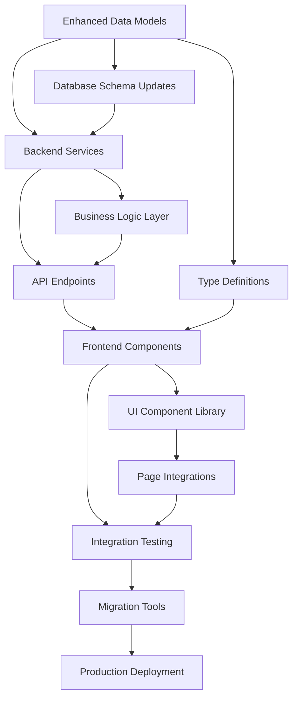

# Enhanced Office Functionality Implementation Plan
## SimpleSim Workforce Simulation Platform

**Version**: 1.0  
**Date**: 2025-08-02  
**Estimated Duration**: 16-20 weeks  
**Team Size**: 2-3 developers  

---

## Executive Summary

This document outlines a comprehensive implementation plan for enhanced office functionality in SimpleSim, transforming the current basic office configuration into a sophisticated multi-dimensional office management system. The enhanced functionality includes hierarchical budget tracking, office-specific CAT matrices, physical space management, regional factors, and multi-year planning capabilities.

### **Key Deliverables**
- **Hierarchical Budget System**: Detailed expense categories with cost center tracking
- **Office-Specific CAT Matrices**: Cultural progression differences between offices
- **Physical Space Management**: Facilities tracking and capacity planning
- **Regional Factors**: Cost of living, tax rates, and cultural considerations
- **Multi-Year Budget Planning**: Long-term financial forecasting
- **Enhanced Visualizations**: Advanced office data visualization and reporting
- **Backward Compatibility**: Seamless migration and continued support for existing scenarios

---

## 1. Complete Feature Breakdown

### **Phase 1: Foundation & Data Models (Weeks 1-4)**

#### **1.1 Enhanced Office Configuration Structure**
**Current**: Basic office config with roles, FTE, and simple economic parameters  
**Enhanced**: Multi-dimensional office profiles with comprehensive metadata

**Implementation Details**:
```typescript
interface EnhancedOfficeConfig {
  // Core office information
  id: string;
  name: string;
  region: RegionConfig;
  office_type: OfficeType;
  journey_stage: JourneyStage;
  
  // Physical space management
  facilities: FacilitiesConfig;
  capacity: CapacityConfig;
  
  // Financial structure
  budget_structure: HierarchicalBudget;
  cost_centers: CostCenterConfig[];
  
  // Cultural and progression
  cat_matrix: OfficeSpecificCATMatrix;
  progression_rules: OfficeProgressionConfig;
  
  // Regional factors
  regional_factors: RegionalFactors;
  
  // Historical data
  historical_data: OfficeHistoricalData;
  
  // Metadata
  created_at: string;
  updated_at: string;
  version: number;
}
```

#### **1.2 Hierarchical Budget Tracking**
**Purpose**: Replace flat budget structure with detailed expense categorization

**Components**:
- **Personnel Costs**: Salaries, benefits, training, recruitment
- **Operational Costs**: Rent, utilities, IT, office supplies
- **Business Costs**: Travel, client entertainment, marketing
- **Capital Expenses**: Equipment, furniture, renovations
- **Indirect Costs**: Shared services allocation, overhead

**Data Structure**:
```typescript
interface HierarchicalBudget {
  fiscal_year: number;
  budget_categories: {
    personnel: PersonnelBudget;
    operational: OperationalBudget;
    business: BusinessBudget;
    capital: CapitalBudget;
    indirect: IndirectBudget;
  };
  cost_centers: CostCenterMapping[];
  approval_workflow: BudgetApprovalConfig;
}
```

#### **1.3 Office-Specific CAT Matrices**
**Purpose**: Model cultural differences affecting career progression between offices

**Features**:
- Cultural factor weighting per office
- Progression speed variations
- Regional career path differences
- Mentorship and training availability
- Performance evaluation standards

**Data Structure**:
```typescript
interface OfficeSpecificCATMatrix {
  office_id: string;
  cultural_factors: {
    hierarchy_orientation: number; // 0-1 scale
    individualism_score: number;
    uncertainty_avoidance: number;
    power_distance: number;
    long_term_orientation: number;
  };
  progression_modifiers: {
    [level: string]: {
      base_progression_rate: number;
      cultural_modifier: number;
      mentorship_availability: number;
      training_investment: number;
    };
  };
  evaluation_criteria: OfficeEvaluationCriteria;
}
```

#### **1.4 Physical Space Management**
**Purpose**: Track and manage office facilities, capacity, and growth planning

**Components**:
- Space allocation and utilization
- Capacity planning and growth projections
- Facility management (meeting rooms, equipment)
- Compliance and safety requirements
- Renovation and expansion planning

**Data Structure**:
```typescript
interface FacilitiesConfig {
  total_area_sqm: number;
  workspace_areas: WorkspaceArea[];
  meeting_facilities: MeetingFacility[];
  equipment_inventory: EquipmentItem[];
  compliance_status: ComplianceStatus;
  expansion_plans: ExpansionPlan[];
}
```

#### **1.5 Regional Factors System**
**Purpose**: Model location-specific economic and cultural factors

**Components**:
- Cost of living adjustments
- Tax rates and regulatory requirements
- Currency considerations
- Local market conditions
- Cultural business practices

**Data Structure**:
```typescript
interface RegionalFactors {
  cost_of_living_index: number;
  tax_structure: TaxStructure;
  currency: CurrencyConfig;
  market_conditions: MarketConditions;
  regulatory_requirements: RegulatoryRequirement[];
  cultural_business_practices: CulturalPractices;
}
```

### **Phase 2: Backend Services & API (Weeks 5-8)**

#### **2.1 Enhanced Office Service Layer**
**Extension of**: `backend/src/services/office_service.py`

**New Methods**:
- `create_enhanced_office_config()`
- `update_budget_structure()`
- `manage_facilities()`
- `configure_cat_matrix()`
- `calculate_regional_adjustments()`
- `generate_capacity_reports()`

#### **2.2 Budget Management Service**
**New Service**: `budget_management_service.py`

**Responsibilities**:
- Hierarchical budget creation and management
- Cost center allocation and tracking
- Budget approval workflows
- Variance analysis and reporting
- Multi-year budget planning

#### **2.3 Facilities Management Service**
**New Service**: `facilities_management_service.py`

**Responsibilities**:
- Space allocation and optimization
- Capacity planning and growth projections
- Equipment inventory management
- Compliance tracking
- Renovation planning

#### **2.4 Regional Analytics Service**
**New Service**: `regional_analytics_service.py`

**Responsibilities**:
- Cost of living calculations
- Regional benchmark comparisons
- Currency conversion and reporting
- Market analysis integration
- Cultural factor modeling

#### **2.5 Enhanced Simulation Engine Integration**
**Modifications to**: `simulation_engine.py`

**Enhancements**:
- Integration with office-specific CAT matrices
- Regional factor adjustments in calculations
- Budget impact modeling
- Facilities capacity constraints
- Multi-year scenario projections

### **Phase 3: Frontend Components & UI (Weeks 9-12)**

#### **3.1 Enhanced Office Management Dashboard**
**Replacement of**: Current basic office views

**Components**:
- **Office Overview Cards**: Key metrics and status indicators
- **Budget Dashboard**: Hierarchical budget visualization
- **Facilities View**: Space utilization and capacity planning
- **Regional Comparison**: Benchmarking across offices
- **Performance Analytics**: CAT matrix effectiveness

#### **3.2 Budget Management Interface**
**New Component**: `BudgetManagementPanel`

**Features**:
- Hierarchical budget tree view
- Drag-and-drop cost allocation
- Budget approval workflow
- Variance analysis charts
- Multi-year planning interface

#### **3.3 Facilities Management Interface**
**New Component**: `FacilitiesManagementPanel`

**Features**:
- Interactive space planning
- Equipment inventory management
- Capacity utilization charts
- Expansion planning tools
- Compliance tracking dashboard

#### **3.4 CAT Matrix Configuration**
**New Component**: `CATMatrixConfigurator`

**Features**:
- Visual cultural factor adjustment
- Progression rate modeling
- Office comparison tools
- Impact analysis visualization
- Template management

#### **3.5 Regional Factors Dashboard**
**New Component**: `RegionalFactorsDashboard`

**Features**:
- Cost of living comparisons
- Tax impact calculations
- Currency conversion tools
- Market condition indicators
- Cultural practice guidelines

### **Phase 4: Advanced Features & Integration (Weeks 13-16)**

#### **4.1 Multi-Year Budget Planning**
**Purpose**: Enable long-term financial planning and scenario modeling

**Features**:
- 3-5 year budget projections
- Growth scenario modeling
- Capital expenditure planning
- ROI analysis and optimization
- Risk assessment and mitigation

#### **4.2 Advanced Analytics & Reporting**
**Purpose**: Provide sophisticated insights and reporting capabilities

**Features**:
- Office performance benchmarking
- Predictive analytics for growth
- Resource optimization recommendations
- Cost efficiency analysis
- Cultural effectiveness metrics

#### **4.3 Integration with Existing Workflows**
**Purpose**: Seamless integration with current simulation and planning processes

**Components**:
- Enhanced scenario creation with office factors
- Business planning integration
- Reporting dashboard updates
- Export functionality enhancements
- API endpoint expansions

#### **4.4 Migration and Compatibility**
**Purpose**: Ensure smooth transition from current system

**Features**:
- Automated data migration scripts
- Backward compatibility layer
- Gradual feature rollout
- Legacy system support
- User training materials

---

## 2. Task Dependencies

### **Critical Path Analysis**



### **Dependency Matrix**

| Component | Depends On | Blocks |
|-----------|------------|--------|
| Enhanced Data Models | Current office config analysis | All backend services |
| Backend Services | Data models, current API structure | Frontend components |
| Budget Management | Data models, KPI service | Budget UI, reporting |
| Facilities Management | Data models, regional service | Facilities UI |
| Regional Analytics | Data models, external APIs | Regional UI, calculations |
| Frontend Components | Backend APIs, design system | Integration testing |
| Simulation Engine Updates | All backend services | Advanced scenarios |
| Migration Tools | All data models | Production deployment |

### **Parallel Development Opportunities**

**Week 1-2**: 
- Data model design (Team A)
- UI/UX design finalization (Team B)
- Infrastructure setup (Team C)

**Week 3-4**:
- Backend service development (Team A)
- Frontend component design (Team B)
- Testing framework setup (Team C)

**Week 5-8**:
- API development (Team A)
- UI component implementation (Team B)
- Integration testing (Team C)

---

## 3. Development Timeline

### **Phase 1: Foundation (Weeks 1-4)**

#### **Week 1: Analysis & Design**
- [ ] Complete requirements analysis and stakeholder interviews
- [ ] Finalize enhanced office data models and schemas
- [ ] Create database migration scripts and strategies
- [ ] Design API contract specifications
- [ ] Set up development environment and tooling

#### **Week 2: Data Layer Implementation**
- [ ] Implement enhanced office configuration models
- [ ] Create hierarchical budget data structures
- [ ] Develop CAT matrix and regional factors models
- [ ] Build facilities management data layer
- [ ] Implement data validation and migration utilities

#### **Week 3: Core Services Development**
- [ ] Extend office service with enhanced functionality
- [ ] Implement budget management service
- [ ] Create facilities management service core
- [ ] Develop regional analytics service foundation
- [ ] Build data transformation and validation services

#### **Week 4: API Layer & Testing**
- [ ] Create enhanced office management API endpoints
- [ ] Implement budget management API routes
- [ ] Develop facilities management API
- [ ] Build regional analytics API endpoints
- [ ] Complete unit testing for all backend services

### **Phase 2: Backend Services (Weeks 5-8)**

#### **Week 5: Advanced Backend Services**
- [ ] Complete budget management service with workflows
- [ ] Implement advanced facilities management features
- [ ] Enhance regional analytics with external data integration
- [ ] Create office comparison and benchmarking services
- [ ] Develop advanced reporting and analytics services

#### **Week 6: Simulation Engine Integration**
- [ ] Integrate enhanced office configs with simulation engine
- [ ] Implement regional factor adjustments in calculations
- [ ] Add facilities capacity constraints to workforce planning
- [ ] Enhance CAT matrix integration with progression modeling
- [ ] Update KPI calculations for enhanced office metrics

#### **Week 7: Data Migration & Compatibility**
- [ ] Create comprehensive data migration scripts
- [ ] Implement backward compatibility layer
- [ ] Build data validation and integrity checking
- [ ] Develop rollback and recovery procedures
- [ ] Test migration with production data samples

#### **Week 8: Backend Integration Testing**
- [ ] Complete integration testing for all backend services
- [ ] Perform load testing and performance optimization
- [ ] Conduct security testing and vulnerability assessment
- [ ] Implement monitoring and logging enhancements
- [ ] Complete API documentation and testing guides

### **Phase 3: Frontend Development (Weeks 9-12)**

#### **Week 9: Core UI Components**
- [ ] Implement enhanced office dashboard components
- [ ] Create hierarchical budget visualization components
- [ ] Build facilities management UI components
- [ ] Develop regional factors display components
- [ ] Implement CAT matrix configuration interface

#### **Week 10: Advanced UI Features**
- [ ] Create multi-year budget planning interface
- [ ] Implement advanced analytics dashboards
- [ ] Build office comparison and benchmarking tools
- [ ] Develop interactive facilities planning interface
- [ ] Create enhanced reporting and export features

#### **Week 11: Page Integration & Navigation**
- [ ] Integrate enhanced components into office pages
- [ ] Update navigation and routing for new features
- [ ] Implement progressive disclosure and user workflows
- [ ] Create contextual help and user guidance
- [ ] Develop responsive design and mobile optimization

#### **Week 12: Frontend Testing & Polish**
- [ ] Complete component testing with React Testing Library
- [ ] Implement E2E testing with Playwright
- [ ] Conduct usability testing and UI refinements
- [ ] Optimize performance and loading times
- [ ] Complete accessibility testing and compliance

### **Phase 4: Integration & Deployment (Weeks 13-16)**

#### **Week 13: System Integration**
- [ ] Complete end-to-end integration testing
- [ ] Test all user workflows and scenarios
- [ ] Validate data consistency and integrity
- [ ] Perform cross-browser and device testing
- [ ] Complete performance testing and optimization

#### **Week 14: Migration & Compatibility Testing**
- [ ] Test data migration with production data
- [ ] Validate backward compatibility with existing scenarios
- [ ] Test gradual feature rollout mechanisms
- [ ] Verify legacy system support and fallbacks
- [ ] Complete user acceptance testing

#### **Week 15: Documentation & Training**
- [ ] Create comprehensive user documentation
- [ ] Develop administrator guides and procedures
- [ ] Create training materials and video guides
- [ ] Implement in-app help and tutorials
- [ ] Prepare change management communications

#### **Week 16: Production Deployment**
- [ ] Execute production deployment with rollback plan
- [ ] Monitor system performance and user adoption
- [ ] Provide user support and issue resolution
- [ ] Collect feedback and plan future iterations
- [ ] Complete project retrospective and lessons learned

---

## 4. Risk Assessment & Mitigation

### **High Risk Items**

#### **4.1 Data Migration Complexity**
**Risk Level**: HIGH  
**Impact**: Complete system failure, data loss
**Probability**: Medium

**Mitigation Strategies**:
- [ ] Create comprehensive backup and rollback procedures
- [ ] Implement incremental migration with validation checkpoints
- [ ] Develop parallel system testing environment
- [ ] Create automated data integrity verification
- [ ] Plan for extended maintenance windows

**Contingency Plan**:
- Full rollback to previous system version
- Manual data correction procedures
- Extended support for legacy system
- Gradual feature re-enablement

#### **4.2 Performance Impact on Simulation Engine**
**Risk Level**: HIGH  
**Impact**: Slow simulation execution, user experience degradation
**Probability**: Medium

**Mitigation Strategies**:
- [ ] Implement comprehensive performance testing
- [ ] Create simulation engine optimization strategies
- [ ] Develop caching and data optimization techniques
- [ ] Plan for horizontal scaling capabilities
- [ ] Implement performance monitoring and alerting

**Contingency Plan**:
- Feature flag system for disabling heavy features
- Performance optimization sprints
- Infrastructure scaling procedures
- Alternative calculation methods

#### **4.3 Complex UI/UX Implementation**
**Risk Level**: MEDIUM  
**Impact**: Poor user adoption, workflow disruption
**Probability**: Medium

**Mitigation Strategies**:
- [ ] Conduct early user testing and feedback sessions
- [ ] Implement progressive disclosure and guided workflows
- [ ] Create comprehensive user training materials
- [ ] Develop fallback to simplified interfaces
- [ ] Plan for iterative UI improvements

**Contingency Plan**:
- Simplified UI implementation
- Extended user training period
- Gradual feature introduction
- Alternative workflow options

### **Medium Risk Items**

#### **4.4 External API Dependencies**
**Risk Level**: MEDIUM  
**Impact**: Regional data unavailability, feature degradation
**Probability**: Low

**Mitigation Strategies**:
- [ ] Implement caching for external data
- [ ] Create fallback data sources
- [ ] Develop offline mode capabilities
- [ ] Establish service level agreements with providers
- [ ] Implement graceful degradation

#### **4.5 Team Capacity and Skill Requirements**
**Risk Level**: MEDIUM  
**Impact**: Delayed delivery, quality issues
**Probability**: Medium

**Mitigation Strategies**:
- [ ] Provide training on complex technologies
- [ ] Implement peer review and mentoring
- [ ] Create detailed implementation guides
- [ ] Plan for external consulting if needed
- [ ] Implement phased delivery to manage complexity

#### **4.6 Backward Compatibility Challenges**
**Risk Level**: MEDIUM  
**Impact**: Existing scenario breakage, user frustration
**Probability**: Low

**Mitigation Strategies**:
- [ ] Implement comprehensive compatibility testing
- [ ] Create automated migration validation
- [ ] Develop legacy system support layer
- [ ] Plan for extended transition period
- [ ] Implement version management system

---

## 5. Testing Strategy

### **5.1 Backend Testing**

#### **Unit Testing**
**Framework**: pytest  
**Coverage Target**: 95%  
**Focus Areas**:
- Data model validation and serialization
- Business logic in service layers
- API endpoint functionality
- Data transformation and migration
- Regional calculations and adjustments

**Test Structure**:
```python
tests/
├── unit/
│   ├── test_enhanced_office_models.py
│   ├── test_budget_management_service.py
│   ├── test_facilities_service.py
│   ├── test_regional_analytics.py
│   └── test_simulation_integration.py
├── integration/
│   ├── test_office_api_endpoints.py
│   ├── test_simulation_workflows.py
│   └── test_data_migration.py
└── performance/
    ├── test_simulation_performance.py
    └── test_api_load_testing.py
```

#### **Integration Testing**
**Framework**: pytest with test fixtures  
**Coverage**: All API endpoints and service integrations  
**Focus Areas**:
- Office management workflows
- Budget allocation and tracking
- Facilities management processes
- Regional factor calculations
- Simulation engine integration

#### **Performance Testing**
**Framework**: pytest-benchmark, locust  
**Targets**:
- Simulation execution time < 30 seconds for complex scenarios
- API response time < 500ms for standard operations
- Database query optimization for large datasets
- Memory usage optimization for large office configurations

### **5.2 Frontend Testing**

#### **Component Testing**
**Framework**: Vitest + React Testing Library  
**Coverage Target**: 90%  
**Focus Areas**:
- Enhanced office dashboard components
- Budget management interface
- Facilities management UI
- CAT matrix configuration
- Regional factors display

**Test Structure**:
```
src/components/
├── enhanced-office/
│   ├── __tests__/
│   │   ├── OfficeDashboard.test.tsx
│   │   ├── BudgetManagement.test.tsx
│   │   ├── FacilitiesManager.test.tsx
│   │   └── RegionalFactors.test.tsx
│   └── ...
```

#### **E2E Testing**
**Framework**: Playwright  
**Coverage**: All critical user workflows  
**Test Scenarios**:
- Office configuration creation and modification
- Budget allocation and approval workflows
- Facilities planning and management
- CAT matrix configuration and testing
- Regional factor analysis and reporting
- Integration with existing simulation workflows

**E2E Test Structure**:
```
e2e/
├── office-management/
│   ├── office-creation-workflow.spec.ts
│   ├── budget-management-workflow.spec.ts
│   ├── facilities-management-workflow.spec.ts
│   └── regional-analysis-workflow.spec.ts
├── integration/
│   ├── enhanced-simulation-workflow.spec.ts
│   └── backward-compatibility.spec.ts
└── performance/
    └── enhanced-office-performance.spec.ts
```

### **5.3 Data Migration Testing**

#### **Migration Validation**
**Framework**: Custom Python scripts  
**Coverage**: All existing office configurations  
**Validation Points**:
- Data integrity preservation
- Performance impact assessment
- Backward compatibility verification
- Rollback procedure testing

#### **Compatibility Testing**
**Framework**: pytest with sample data  
**Coverage**: All existing scenarios and business plans  
**Focus Areas**:
- Existing scenario execution
- Business plan calculations
- Report generation
- Export functionality

### **5.4 User Acceptance Testing**

#### **Stakeholder Testing**
**Duration**: 2 weeks  
**Participants**: Business users, administrators, power users  
**Focus Areas**:
- User workflow efficiency
- Feature completeness
- Interface usability
- Performance satisfaction

#### **Beta Testing**
**Duration**: 1 week  
**Participants**: Representative user group  
**Focus Areas**:
- Real-world usage scenarios
- Integration with existing workflows
- Performance under realistic conditions
- User training effectiveness

---

## 6. Release Plan

### **6.1 Phased Rollout Strategy**

#### **Phase 1: Foundation Release (Week 17)**
**Target Users**: Internal development team and key stakeholders  
**Features**:
- Enhanced office configuration (read-only)
- Basic budget structure visualization
- Regional factors display
- Backward compatibility layer

**Success Criteria**:
- All existing scenarios execute without errors
- New office configurations can be viewed
- Performance meets baseline requirements
- Zero data integrity issues

#### **Phase 2: Core Features Release (Week 18)**
**Target Users**: Administrative users and office managers  
**Features**:
- Full office configuration management
- Budget allocation and tracking
- Basic facilities management
- CAT matrix configuration

**Success Criteria**:
- Office configurations can be created and modified
- Budget workflows function correctly
- User training completion rate > 80%
- User satisfaction score > 7/10

#### **Phase 3: Advanced Features Release (Week 19)**
**Target Users**: All users with feature flags  
**Features**:
- Multi-year budget planning
- Advanced analytics and reporting
- Facilities optimization tools
- Regional benchmarking

**Success Criteria**:
- Advanced features adoption rate > 60%
- Performance targets maintained
- User feedback incorporated
- Support ticket volume < 10% increase

#### **Phase 4: Full Production Release (Week 20)**
**Target Users**: All users  
**Features**:
- Complete enhanced office functionality
- Full integration with existing workflows
- Comprehensive reporting and analytics
- Mobile optimization

**Success Criteria**:
- Feature adoption rate > 90%
- User satisfaction score > 8/10
- Performance improvements demonstrated
- Business value metrics achieved

### **6.2 Feature Flags and Gradual Enablement**

#### **Feature Flag Strategy**
```typescript
interface FeatureFlags {
  enhanced_office_config: boolean;
  hierarchical_budgets: boolean;
  facilities_management: boolean;
  regional_analytics: boolean;
  multi_year_planning: boolean;
  advanced_cat_matrices: boolean;
}
```

#### **Rollout Schedule**
- **Week 17**: `enhanced_office_config` = true
- **Week 18**: `hierarchical_budgets` = true, `regional_analytics` = true
- **Week 19**: `facilities_management` = true, `advanced_cat_matrices` = true
- **Week 20**: `multi_year_planning` = true (all features enabled)

### **6.3 Rollback Procedures**

#### **Immediate Rollback Triggers**
- Data corruption or integrity issues
- Performance degradation > 50%
- Critical functionality failure
- User error rate > 25%

#### **Rollback Process**
1. **Immediate**: Disable feature flags
2. **Short-term**: Revert to previous application version
3. **Medium-term**: Restore database from backup if necessary
4. **Long-term**: Address issues and re-plan deployment

### **6.4 Success Metrics and KPIs**

#### **Technical Metrics**
- **Performance**: Simulation execution time improvement
- **Reliability**: System uptime and error rates
- **Scalability**: Capacity for increased office configurations
- **Security**: Vulnerability assessment scores

#### **Business Metrics**
- **User Adoption**: Feature usage rates and user engagement
- **Efficiency**: Time savings in office management workflows
- **Accuracy**: Improved planning and forecasting precision
- **Satisfaction**: User feedback and support ticket trends

#### **Success Thresholds**
- Performance improvement: 15% faster than baseline
- User adoption: 90% within 4 weeks of full release
- Error reduction: 50% fewer office management related issues
- User satisfaction: 8.5/10 average rating

---

## 7. Implementation Considerations

### **7.1 Architecture Integration**

#### **Maintaining SimpleSim Design Principles**
- **Task-Oriented Architecture**: Enhanced office features follow user goals
- **Progressive Disclosure**: Complex features hidden behind simple interfaces
- **Desktop-First**: Optimized for desktop office management workflows
- **Single Navigation**: Integrated with existing top navigation system

#### **Data Model Compatibility**
- Extend existing `unified_data_models.py` with enhanced structures
- Maintain compatibility with current `ScenarioDefinition` interfaces
- Preserve existing API contracts while adding new endpoints
- Ensure simulation engine continues to work with legacy data

### **7.2 Performance Optimization**

#### **Database Optimization**
- Implement efficient indexing for office hierarchies
- Use connection pooling for concurrent office operations
- Cache frequently accessed regional data
- Optimize queries for budget rollup calculations

#### **Frontend Optimization**
- Implement lazy loading for complex office visualizations
- Use React.memo for expensive budget calculation components
- Implement virtual scrolling for large office lists
- Cache regional factor calculations

### **7.3 Security Considerations**

#### **Access Control**
- Implement role-based access for office configuration
- Secure budget information with appropriate permissions
- Audit trail for all office management operations
- Data encryption for sensitive regional information

#### **Data Privacy**
- Ensure GDPR compliance for office personnel data
- Implement data retention policies for historical information
- Secure API endpoints with proper authentication
- Monitor and log access to sensitive office configurations

### **7.4 Scalability Planning**

#### **Horizontal Scaling**
- Design services to be stateless for load balancing
- Implement database sharding strategies for large datasets
- Plan for microservices architecture if needed
- Design for multi-region deployment capabilities

#### **Vertical Scaling**
- Optimize memory usage for large office configurations
- Implement efficient algorithms for complex calculations
- Plan for increased database capacity requirements
- Monitor and tune performance bottlenecks

---

## 8. Conclusion

The enhanced office functionality represents a significant evolution of SimpleSim's capabilities, transforming it from a basic workforce simulation tool into a comprehensive office management and planning platform. This implementation plan provides a structured approach to delivering these enhancements while maintaining system reliability, performance, and user experience.

### **Key Success Factors**
1. **Phased Implementation**: Gradual rollout minimizes risk and allows for iterative improvement
2. **Backward Compatibility**: Existing users can continue using the system without disruption
3. **Comprehensive Testing**: Multi-layer testing strategy ensures quality and reliability
4. **User-Centered Design**: Features align with real-world office management workflows
5. **Performance Focus**: Enhancements improve rather than degrade system performance

### **Expected Outcomes**
- **Enhanced Planning Capabilities**: More accurate and detailed workforce planning
- **Improved Decision Making**: Better insights through regional and cultural factors
- **Operational Efficiency**: Streamlined office management workflows
- **Strategic Alignment**: Long-term planning capabilities for business growth
- **User Satisfaction**: More powerful and intuitive office management experience

### **Next Steps**
1. Stakeholder review and approval of implementation plan
2. Team capacity planning and resource allocation
3. Development environment setup and tool preparation
4. Detailed technical design for Phase 1 components
5. Risk mitigation planning and contingency preparation

This implementation plan provides a roadmap for successfully delivering enhanced office functionality while maintaining SimpleSim's reputation for reliability, performance, and user experience.